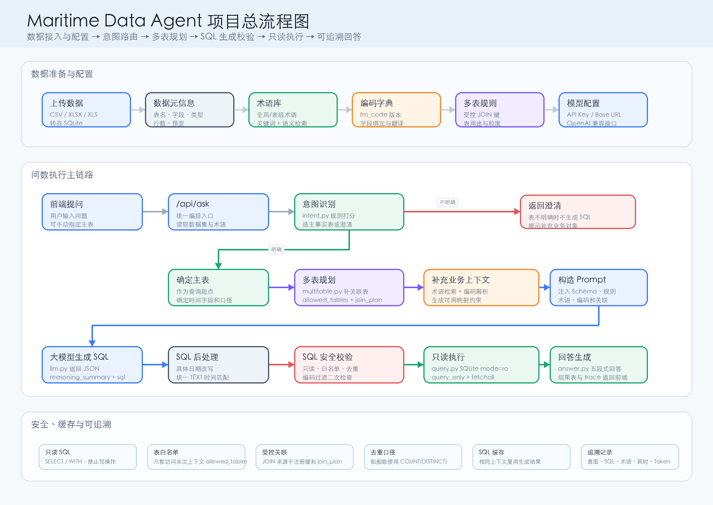

# Maritime Data Agent

面向航运业务数据的本地智能问数 Agent。项目支持上传 CSV / Excel 表格，用自然语言查询航运业务数据，并通过 Planner、Tool Registry、Memory、SQL 安全校验、自动修复和离线评测，把普通 NL2SQL 流程升级为可观测、可追溯、可回归验证的领域 Agent。



## 项目亮点

- **Agent 主循环**：后端通过 `run_data_agent` 统一管理一次问数任务的状态、计划、工具调用和最终响应。
- **Planner 规划器**：根据路由结果动态选择查询、澄清、SQL 修复或失败停止链路。
- **Tool Registry**：将上下文读取、意图识别、表规划、术语检索、编码解析、SQL 生成、SQL 校验、查询执行、答案生成等能力封装成可观测工具。
- **Agent Memory**：自动保存历史问数记录，下一次查询前召回相似问题、历史 SQL 和业务口径。
- **SQL 安全边界**：仅允许单条只读 `SELECT` / `WITH ... SELECT`，拦截写操作、多语句、越权表访问和 `CROSS JOIN`。
- **自动 SQL 修复**：SQL 校验或执行失败时，把错误反馈给模型进行一次受控修复，并重新进入安全校验。
- **离线 Eval**：提供不依赖大模型和真实业务数据的评测集，覆盖 Planner、工具契约、Memory 和 SQL 安全边界。
- **前端执行轨迹**：页面展示 Planner 决策、工具调用顺序、耗时、SQL、结果明细、Token 用量和追溯编号。

## Agent 架构

```text
用户问题
  -> Agent 初始化任务状态
  -> Planner 制定上下文读取和意图识别计划
  -> context.load 读取数据目录和术语库
  -> intent.route 识别意图、主表和候选表
  -> Planner 选择澄清链路或查询链路
  -> memory.recall 召回相似历史问数
  -> table.plan 规划单表或多表访问
  -> terms.retrieve 检索业务术语和统计口径
  -> codes.resolve 解析业务编码映射
  -> sql.generate 生成 SQLite SQL
  -> sql.validate 执行安全、语义和编码边界校验
  -> query.execute 只读执行查询
  -> answer.build / answer.summarize 生成可追溯中文回答
  -> memory.save 保存本次问数经验
```

核心模块：

| 模块 | 作用 |
| --- | --- |
| `app/agent.py` | Agent 主循环、任务状态、执行轨迹和响应聚合 |
| `app/agent_planner.py` | 规则型 Planner，负责选择查询、澄清、修复或失败计划 |
| `app/agent_tools.py` | 工具注册表和本地工具封装 |
| `app/agent_memory.py` | 历史问数保存、相似问题召回和记忆评分 |
| `app/agent_eval.py` | 离线 Agent 评测集 |
| `app/llm.py` | OpenAI-compatible 模型调用、SQL 生成和 SQL 修复 |
| `app/query.py` | SQL 安全校验和只读执行 |
| `app/multitable.py` | 多表选择、受控 JOIN 规则和关联上下文 |
| `app/code_dictionary.py` | 业务编码字典、编码绑定和结果翻译 |
| `app/term_retrieval.py` | 业务术语关键词检索和本地向量语义检索 |

## 功能说明

### 自然语言问数

- 支持上传 CSV、XLSX、XLS 数据表。
- 自动识别问题意图、业务对象、统计指标和候选数据表。
- 支持手动指定主表，也支持系统自动路由。
- 对数据表或业务对象不明确的问题返回澄清提示，不盲目生成 SQL。
- 回答中展示直接结论、结果明细、SQL、统计口径和追溯信息。

### 多表查询

- 根据问题线索、字段名称、表用途和业务术语自动补充关联表。
- 仅允许使用受控关联字段，如 `target_id`、`mmsi`、`imo`、`event_uuid`。
- 多表船舶数量统计要求使用 `COUNT(DISTINCT ...)`，避免 JOIN 后重复计数。
- 最终 SQL 会再次经过表白名单和语义安全校验。

### 业务术语库

- 支持新增、编辑、搜索、删除术语。
- 支持同义词和全局/指定数据集关联。
- 支持 Excel 批量导入和导出。
- 术语会参与意图识别、数据表路由和 SQL 生成。
- 默认支持 FastEmbed 本地语义检索，模型不可用时自动回退关键词检索。

### 业务数值映射

- 解决“用户说中文名称，数据库保存编码”的问题。
- 支持导入编码字典，字段包括 `dict_type`、`dict_code`、`name_cn`。
- 支持将数据表字段绑定到编码类型，例如船舶类型、航行状态、风险等级。
- SQL 生成时只允许使用字典中的真实编码，禁止模型猜测编码值。
- 查询结果会自动把编码翻译回中文业务名称。

### Agent Memory

- 每次成功问数或澄清都会写入本地 SQLite 记忆表。
- 保存问题、意图、数据集、表名、SQL、答案摘要、结果行数、修复状态和追溯编号。
- 后续问题会按文本相似度、意图、数据集和表名召回历史经验。
- 前端 Agent 面板展示召回数量和保存的 memory id。

### Agent Eval

离线评测接口 `/api/agent/evals` 当前覆盖：

- 查询链路是否先召回记忆再生成 SQL。
- 澄清链路是否不会进入 SQL 执行。
- SQL 失败是否只在受控次数内触发修复。
- Tool Registry 是否暴露完整工具契约。
- 合法只读 SQL 是否可通过校验。
- 危险 SQL、越权表访问和 `CROSS JOIN` 是否会被拦截。
- 相似历史问题是否能达到召回阈值。

示例返回：

```json
{
  "suite": "maritime_agent_offline_evals",
  "version": "agent_step_5_evals",
  "passed": true,
  "score": 1.0,
  "summary": {
    "total": 7,
    "passed": 7,
    "failed": 0
  }
}
```

## 技术栈

- Python
- FastAPI
- SQLite
- Pandas / OpenPyXL / xlrd
- OpenAI-compatible Chat Completions API
- FastEmbed / ONNX 本地向量检索
- 原生 HTML / CSS / JavaScript
- Python `unittest`

## 快速开始

建议使用 Python 3.10 或更高版本。

```bash
python -m venv .venv
source .venv/bin/activate
pip install -r requirements.txt
uvicorn app.main:app --reload --host 127.0.0.1 --port 8000
```

Windows PowerShell：

```powershell
python -m venv .venv
.venv\Scripts\Activate.ps1
pip install -r requirements.txt
uvicorn app.main:app --reload --host 127.0.0.1 --port 8000
```

启动后访问：

- 应用首页：<http://127.0.0.1:8000>
- API 文档：<http://127.0.0.1:8000/docs>
- 健康检查：<http://127.0.0.1:8000/api/health>
- Agent 工具清单：<http://127.0.0.1:8000/api/agent/manifest>
- Agent 记忆列表：<http://127.0.0.1:8000/api/agent/memory>
- Agent 离线评测：<http://127.0.0.1:8000/api/agent/evals>

## 使用流程

1. 在“数据表”中上传 CSV 或 Excel 文件，并检查字段和预览数据。
2. 在“术语库”中补充业务术语、同义词和统计口径。
3. 如数据包含枚举编码，在“业务数值映射”中导入编码字典并绑定字段。
4. 在“模型设置”中填写 API Base URL、模型名称和 API Key，并测试连接。
5. 回到“问数助手”，输入自然语言问题。
6. 在回答下方展开执行详情，查看 Planner、工具轨迹、SQL、结果明细和追溯信息。

## 测试与验证

```bash
python -m compileall app tests
python -m unittest discover -s tests
```

前端脚本语法检查：

```bash
node --check app/static/app.js
```

离线 Agent Eval：

```bash
curl http://127.0.0.1:8000/api/agent/evals
```

## API 概览

| 接口 | 说明 |
| --- | --- |
| `POST /api/ask` | 提交自然语言问题，返回答案、SQL、结果和 Agent 轨迹 |
| `GET /api/datasets` | 查看已上传数据表 |
| `POST /api/datasets` | 上传 CSV / Excel 数据表 |
| `GET /api/terms` | 查看业务术语 |
| `POST /api/terms` | 新增业务术语 |
| `GET /api/agent/manifest` | 查看 Agent Planner 和工具清单 |
| `GET /api/agent/memory` | 查看最近保存的问数记忆 |
| `GET /api/agent/evals` | 运行离线 Agent 评测 |
| `POST /api/model/test` | 测试模型连接 |

## 目录结构

```text
.
├── app/
│   ├── agent.py
│   ├── agent_eval.py
│   ├── agent_memory.py
│   ├── agent_planner.py
│   ├── agent_tools.py
│   ├── code_dictionary.py
│   ├── db.py
│   ├── intent.py
│   ├── llm.py
│   ├── main.py
│   ├── multitable.py
│   ├── query.py
│   ├── relationships.py
│   ├── term_retrieval.py
│   └── static/
├── data/
│   └── .gitkeep
├── outputs/
│   ├── project-overview-flowchart.png
│   └── project-overview-flowchart-nature.png
├── tests/
│   └── test_agent.py
├── .gitignore
├── README.md
└── requirements.txt
```
