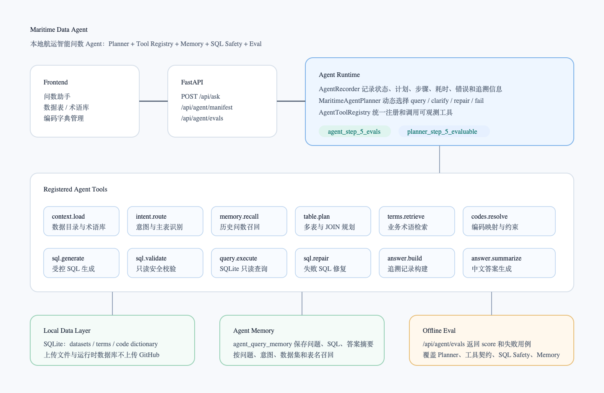
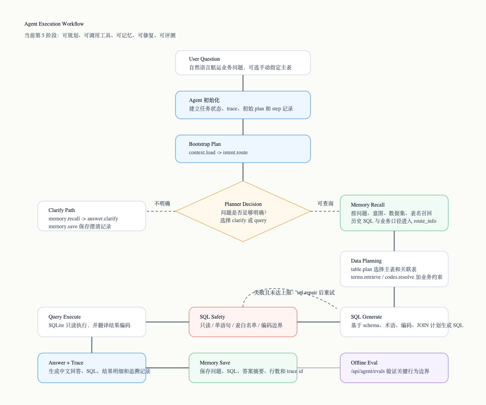

# Maritime Data Agent（航运智能问数 Agent）

Maritime Data Agent 是一个面向航运业务数据的本地智能问数 Agent。项目支持导入 CSV / Excel 数据表，并通过自然语言完成数据查询、统计分析和可追溯回答。

与传统 NL2SQL 示例不同，本项目将问数流程拆分为 Planner 规划、工具编排、业务术语检索、编码映射、SQL 安全校验、自动修复、历史记忆召回和离线评测等多个可观测环节，适用于需要解释查询过程、控制 SQL 风险并沉淀领域经验的结构化数据分析场景。





## 项目概述

航运业务数据通常来自 AIS、船舶档案、进出区域记录、风险事件、违规记录等结构化表格。业务人员希望直接用中文提问，例如“今天进入吴淞 VTS 区域的船舶有多少艘”“货船中高风险目标有哪些”，系统需要理解业务含义、选择正确数据表、处理编码字段，并生成可信的查询结果。

Maritime Data Agent 的目标是提供一个本地可运行、过程可追溯、边界可验证的航运数据问数系统。它不仅生成 SQL，还会记录 Agent 的计划、工具调用、校验结果、查询结果、答案生成过程和历史记忆状态，便于调试、演示和后续扩展。

当前版本支持：

- CSV、XLSX、XLS 数据表导入。
- 面向本地 SQLite 数据表的自然语言问数。
- 航运业务术语库和同义词管理。
- 业务编码字典映射，例如船舶类型、航行状态、风险等级等。
- 单表和多表查询规划。
- 只读 SQL 安全校验与执行。
- SQL 校验或执行失败后的受控自动修复。
- 历史问数记忆保存与相似问题召回。
- 不依赖大模型和真实业务数据的离线 Agent 评测。
- 前端展示 Planner 决策、工具调用轨迹、SQL、结果明细和性能指标。

## 系统架构

后端围绕 Agent Runtime 组织，而不是将所有逻辑写在单一问答接口中。一次问数请求会先进入 Agent 主循环，由 Planner 判断执行路径，再通过 Tool Registry 调用各个本地工具，最后聚合为可追溯响应。

```text
用户问题
  -> Agent 初始化任务状态和追溯记录
  -> Planner 生成初始计划
  -> context.load 读取数据目录和业务术语
  -> intent.route 识别意图、主表和候选表
  -> Planner 选择澄清、查询、修复或失败路径
  -> memory.recall 召回相似历史问数
  -> table.plan 规划单表或多表访问
  -> terms.retrieve 检索业务定义和统计口径
  -> codes.resolve 将业务名称映射为数据库编码
  -> sql.generate 生成受控 SQLite SQL
  -> sql.validate 校验只读、表权限、语义和编码边界
  -> query.execute 在 SQLite 中只读执行查询
  -> answer.build 构建结构化答案事实和追溯信息
  -> answer.summarize 生成最终中文回答
  -> memory.save 保存本次问数经验
```

### 核心模块

| 模块 | 说明 |
| --- | --- |
| `app/agent.py` | Agent 主循环、任务状态管理、执行轨迹记录和响应聚合 |
| `app/agent_planner.py` | 规则型 Planner，负责选择查询、澄清、修复或失败路径 |
| `app/agent_tools.py` | Tool Registry 和本地工具适配层 |
| `app/agent_memory.py` | 历史问数记忆保存、召回和相似度评分 |
| `app/agent_eval.py` | 离线 Agent 评测集 |
| `app/llm.py` | 兼容 OpenAI Chat Completions 的模型调用、SQL 生成和答案生成 |
| `app/query.py` | SQL 安全校验和 SQLite 只读执行 |
| `app/multitable.py` | 多表选择、受控 JOIN 规则和关联上下文构建 |
| `app/code_dictionary.py` | 业务编码字典、字段绑定和查询结果翻译 |
| `app/term_retrieval.py` | 业务术语关键词检索和本地向量语义检索 |

## 核心能力

### 1. Planner 任务规划

Planner 会根据路由结果和运行时错误选择执行路径：

- `bootstrap`：读取数据集、字段和术语，并识别用户问题。
- `clarify`：当问题缺少必要上下文时，生成澄清提示，不进入 SQL 查询。
- `query`：生成、校验、执行 SQL，并生成可追溯答案。
- `repair`：SQL 校验或执行失败时，在受控次数内尝试自动修复。
- `fail`：当问题无法安全处理或修复次数已达上限时停止执行。

### 2. Tool Registry 工具编排

系统将每个 Agent 能力注册为带有输入输出契约的工具。工具清单可以通过 `/api/agent/manifest` 查看，便于调试和扩展。

核心工具包括：

- `context.load`
- `intent.route`
- `memory.recall`
- `table.plan`
- `terms.retrieve`
- `codes.resolve`
- `model.configure`
- `sql.generate`
- `sql.validate`
- `query.execute`
- `sql.repair`
- `answer.build`
- `answer.summarize`
- `memory.save`

### 3. Agent Memory

系统会将成功问数或澄清记录保存到本地 SQLite。每条记忆包含原始问题、标准化问题、回答状态、意图类型、数据集、表名、SQL、生成依据、答案摘要、结果行数、修复状态和追溯编号。

在后续查询前，Agent 会根据问题相似度、意图匹配、数据集匹配和表名匹配召回历史记忆，并将可参考的历史 SQL 和业务口径加入上下文。

### 4. SQL 安全边界

SQL 校验层用于降低模型生成 SQL 的执行风险：

- 仅允许单条 `SELECT` 或 `WITH ... SELECT` 查询。
- 拦截 `INSERT`、`UPDATE`、`DELETE`、`DROP`、`ALTER` 等写操作。
- SQL 只能访问 Agent 当前路由和多表规划允许的数据表。
- 禁止 `CROSS JOIN`。
- 多表船舶数量统计要求使用 `COUNT(DISTINCT ...)`，避免 JOIN 后重复计数。
- 编码字段筛选会和业务编码字典进行二次校验。

### 5. 离线 Agent 评测

项目内置离线评测集，不需要大模型 API Key，也不依赖真实业务数据。评测接口 `/api/agent/evals` 会检查关键 Agent 行为是否符合预期。

当前评测覆盖：

- 查询链路是否先召回记忆再生成 SQL。
- 澄清链路是否不会进入 SQL 执行。
- SQL 失败是否只在受控次数内触发修复。
- Tool Registry 是否暴露完整工具契约。
- 合法只读 SQL 是否能通过校验。
- 危险 SQL、越权表访问和 `CROSS JOIN` 是否会被拦截。
- 相似历史问题是否能达到记忆召回阈值。

示例返回：

```json
{
  "suite": "maritime_agent_offline_evals",
  "version": "agent_step_5_evals",
  "passed": true,
  "score": 1.0,
  "summary": {
    "total": 7,
    "passed": 7,
    "failed": 0
  }
}
```

## 技术栈

- Python
- FastAPI
- SQLite
- Pandas
- OpenPyXL / xlrd
- OpenAI-compatible Chat Completions API
- FastEmbed / ONNX 本地语义检索
- HTML / CSS / JavaScript
- Python `unittest`

## 快速开始

### 环境要求

- Python 3.10 或更高版本
- Node.js，可选，用于前端 JavaScript 语法检查
- 兼容 OpenAI Chat Completions 的模型服务，用于实际问数和答案生成

### 安装依赖

```bash
python -m venv .venv
source .venv/bin/activate
pip install -r requirements.txt
```

Windows PowerShell：

```powershell
python -m venv .venv
.venv\Scripts\Activate.ps1
pip install -r requirements.txt
```

### 启动服务

```bash
uvicorn app.main:app --reload --host 127.0.0.1 --port 8000
```

启动后访问：

- Web 界面：<http://127.0.0.1:8000>
- API 文档：<http://127.0.0.1:8000/docs>
- 健康检查：<http://127.0.0.1:8000/api/health>

## 使用流程

1. 在数据表页面上传 CSV 或 Excel 文件。
2. 在术语库中维护业务术语、定义和同义词。
3. 如果数据表中存在编码字段，在业务数值映射页面导入编码字典并绑定字段。
4. 在模型设置中填写 Base URL、模型名称和 API Key。
5. 在问数助手中输入自然语言问题。
6. 展开回答详情，查看 Planner 决策、工具轨迹、SQL、原始结果、耗时指标和记忆状态。

## API 接口

| 接口 | 方法 | 说明 |
| --- | --- | --- |
| `/api/ask` | `POST` | 提交自然语言问题，返回答案、SQL、结果行、指标和 Agent 轨迹 |
| `/api/datasets` | `GET` | 查看已上传数据表 |
| `/api/datasets` | `POST` | 上传 CSV 或 Excel 数据表 |
| `/api/terms` | `GET` | 查看业务术语 |
| `/api/terms` | `POST` | 新增业务术语 |
| `/api/agent/manifest` | `GET` | 查看 Planner 元数据和 Agent 工具清单 |
| `/api/agent/memory` | `GET` | 查看最近保存的问数记忆 |
| `/api/agent/evals` | `GET` | 运行离线 Agent 评测 |
| `/api/model/test` | `POST` | 测试模型连接 |

## 测试与验证

运行 Python 编译检查和单元测试：

```bash
python -m compileall app tests
python -m unittest discover -s tests
```

运行前端脚本语法检查：

```bash
node --check app/static/app.js
```

服务启动后运行离线 Agent 评测：

```bash
curl http://127.0.0.1:8000/api/agent/evals
```

## 项目结构

```text
.
├── app/
│   ├── agent.py
│   ├── agent_eval.py
│   ├── agent_memory.py
│   ├── agent_planner.py
│   ├── agent_tools.py
│   ├── answer.py
│   ├── code_dictionary.py
│   ├── db.py
│   ├── intent.py
│   ├── llm.py
│   ├── main.py
│   ├── multitable.py
│   ├── query.py
│   ├── relationships.py
│   ├── term_retrieval.py
│   └── static/
├── data/
│   └── .gitkeep
├── outputs/
│   ├── agent-system-architecture.png
│   ├── agent-system-architecture.svg
│   ├── agent-execution-workflow.png
│   └── agent-execution-workflow.svg
├── tests/
│   └── test_agent.py
├── .gitignore
├── README.md
└── requirements.txt
```

## 数据与密钥

项目只保留源码、测试、静态资源、文档和架构图。运行时数据和密钥默认不进入版本控制。

以下内容会被 `.gitignore` 排除：

- `data/*.db`：本地 SQLite 数据库
- `data/uploads/`：用户上传的数据文件
- `data/models/`：本地嵌入模型文件
- `.env` 和 `.env.local`：环境变量文件
- `.venv/`：Python 虚拟环境
- `__pycache__/` 和 `*.pyc`：Python 缓存文件

模型 API Key 保存在浏览器本地存储中，并只会随模型相关请求临时发送到后端。后端不会持久化 API Key。

## 安全说明

本项目适合本地开发、原型验证和受控内部数据探索。现有 SQL 执行层已经具备只读校验、表白名单、语义约束和编码约束，但生产环境仍应增加更完整的安全措施。

生产部署前建议补充：

- 用户认证和权限控制
- 数据集级访问隔离
- HTTPS
- 请求审计日志
- 密钥管理
- 速率限制
- 更完整的真实业务评测集

## 发展路线

- 增加公开 Demo 数据集和可复现实例问题。
- 为 `/api/agent/evals` 增加前端评测看板。
- 增加 CI 流程，自动运行单元测试和离线 Agent 评测。
- 将 Memory 从相似问题召回扩展为可复用 SQL 模板。
- 增加用户反馈收集，用于评估答案质量和 SQL 正确性。
- 增加多用户部署所需的角色权限控制。
